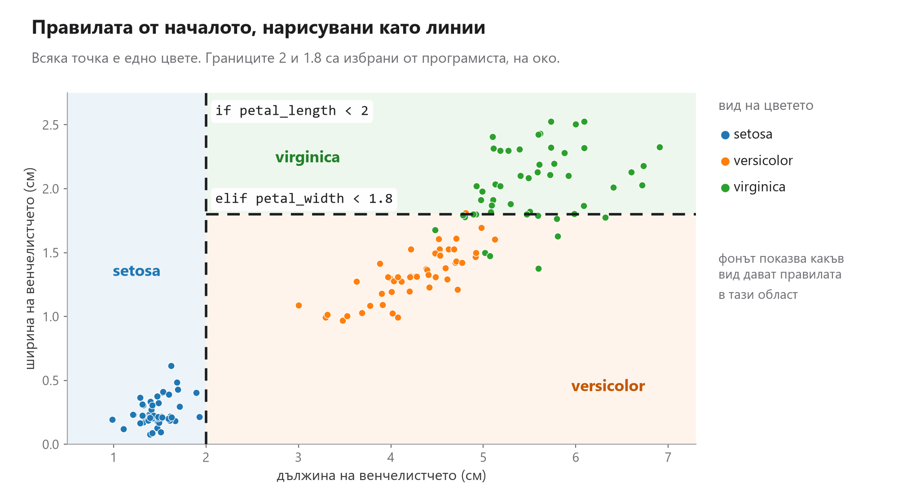
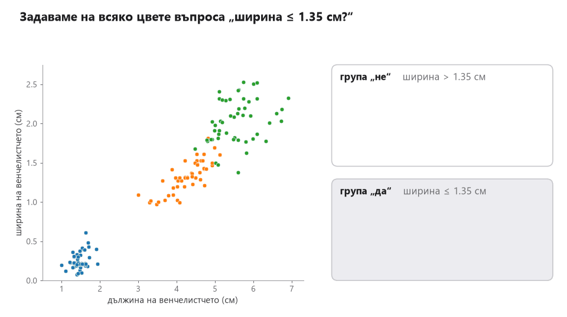
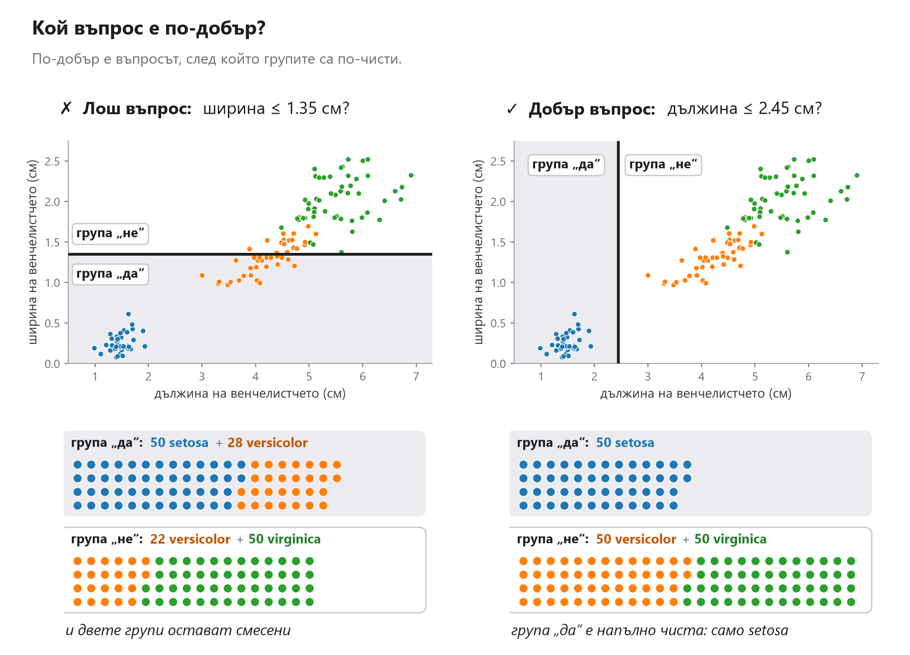
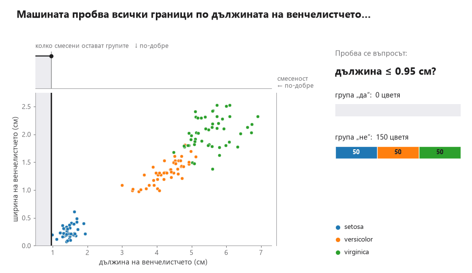
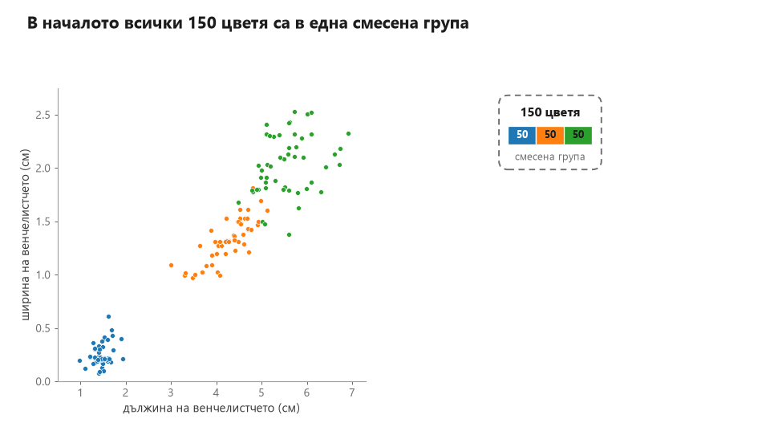
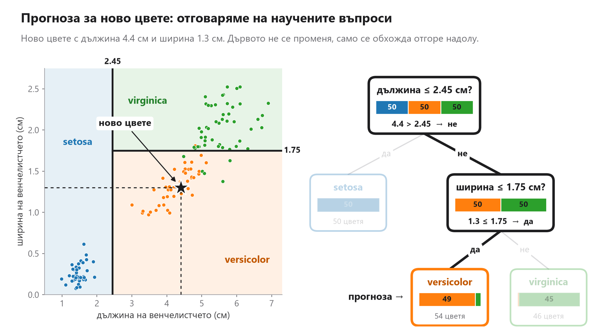

# Какво се опитваме да постигнем с машинното самообучение?

## Да започнем с един проблем

Представете си, че искаме да можем да определяме **вида на цвете по неговите измервания**.

Разполагаме с много цветя, за които вече знаем вида. За всяко от тях сме измерили например дължината и ширината на венчелистчетата и чашелистчетата.

След това получаваме **ново цвете**. Можем да направим същите измервания, но не знаем към кой вид принадлежи.

Въпросът е:

> **Можем ли да използваме това, което знаем за вече наблюдаваните цветя, за да определим вида на новото?**

Това е типичен проблем, който можем да се опитаме да решим с машинно самообучение.

## Какво имаме?

Имаме **примери от миналото**.

За всеки пример знаем две неща:

- неговите характеристики (признаци, features) - например измерванията на цветето;
- правилния отговор (целевата стойност) - вида на цветето.

Тези примери са нашите **данни**.

## Какво искаме?

Не искаме просто да запомним всички цветя, които вече сме виждали.

Искаме от тях да открием **полезни закономерности**.

Ако определени измервания обикновено се срещат при един вид, а други измервания - при друг, тази информация може да ни помогне, когато се появи ново цвете.

Така преминаваме от:

**"Какво знаем за наблюдаваните цветя?"**

към:

**"Какво можем да кажем за цвете, което не сме виждали досега?"**


## Как бихме решили проблема без машинно самообучение?

Преди да използваме машинно самообучение, можем да опитаме да решим задачата по традиционния начин: като напишем програма с **ръчно зададени правила**.

Например можем да кажем:

```python
if petal_length < 2:
    species = "setosa"
elif petal_width < 1.8:
    species = "versicolor"
else:
    species = "virginica"
```

Тук програмистът сам решава кои измервания са важни и къде трябва да бъдат границите.

При малък и прост проблем това може да работи добре.

Но какво става, ако добавим още признаци?

Освен дължина и ширина на венчелистчето може да имаме дължина и ширина на чашелистчето. После може да добавим цвят, форма, тегло, място на произход, климат и още десетки характеристики.

Тогава правилата започват да изглеждат така:

```python
if petal_length < ... and petal_width < ...:
    ...
elif sepal_length > ... and petal_width < ... and sepal_width > ...:
    ...
elif ...
```

С всяка нова характеристика трябва да мислим за още комбинации от условия.

Броят на възможните случаи нараства много бързо, а правилата започват да си противоречат, да стават трудни за поддръжка и още по-трудни за подобряване.

Проблемът вече не е просто, че кодът става дълъг.

По-същественият проблем е, че **ние самите трябва предварително да знаем всички полезни правила**.

При много реални задачи това е практически невъзможно.

## Какво променя машинното самообучение?

Вместо ние да описваме ръчно всяко правило, даваме на системата много примери и я оставяме да **открие закономерностите в данните**.

Така ролята на програмиста се променя:

- при традиционното програмиране ние **задаваме правилата**;
- при машинното самообучение **даваме примери**, а закономерностите се извличат от тях.

Това е особено полезно, когато имаме много признаци и връзките между тях са прекалено сложни, за да ги опишем надеждно с голям брой `if`/`else` условия.

## Какво означава "обучение"?

Дотук казахме, че вместо ние да описваме всички правила с `if` и `else`, можем да дадем на машината множество примери и да я оставим да открие закономерностите в тях.

Точно този процес наричаме **обучение**.

При цветята, например, разполагаме с много примери. За всяко цвете имаме неговите **признаци** - дължина и ширина на чашелистчето и венчелистчето - и знаем правилния отговор: към кой вид принадлежи.

По време на обучението използваме тези примери, за да открием как признаците са свързани с отговора.

**признаци + известни отговори → обучение → научена закономерност**

Важното е, че при машинното самообучение не задаваме предварително всички правила. Вместо това **правилата или закономерностите се извличат от примерите по време на обучението**.

След като обучението приключи, можем да използваме наученото за ново цвете: подаваме неговите признаци и се опитваме да определим вида му.

Така вече можем да разграничим две различни неща:

- **обучение** - използваме примери с известни отговори, за да открием закономерности;
- **прогнозиране** - използваме наученото, за да получим отговор за нов пример.

## Това е основната идея на машинното самообучение:

> При машинното самообучение използваме **наблюдавани примери**, за да научим **закономерности**, които могат да ни помогнат при **нови случаи** чрез **прогноза**.

Така процесът става:

**от примери, за които знаем отговора, откриваме закономерности и при нов пример даваме прогноза**

В примера с цветята прогнозата е **към кой вид принадлежи новото цвете**.

Но можем да поставим много други задачи по същия начин.

Например можем да използваме данни за вече продадени жилища, за да оценим **цената на ново жилище**. Можем да използваме информация за предишни имейли, за да определим дали **нов имейл е спам**. Можем да използваме наблюдения за клиенти, за да преценим дали **нов клиент вероятно ще се откаже от дадена услуга**.

Във всички тези случаи конкретният въпрос е различен, но идеята е една и съща:

> **Използваме това, което вече знаем, за да направим полезно предположение за нещо, което още не знаем.**

## "Научаване" не означава запомняне

Ако просто запомним отговорите за всички примери, които вече имаме, това няма да реши проблема.

Причината е проста: интересува ни **следващият пример**.

Новото цвете няма да бъде напълно идентично с някое от цветята, които вече сме измерили. Новото жилище няма да бъде напълно идентично с вече продадено жилище.

Затова търсим закономерности, които не важат само за отделните примери, а могат да бъдат полезни и за **нови, невиждани данни**.

Тази способност се нарича **обобщаване**.

## Когато имаме задача за машинно самообучение

Преди да мислим как ще решим даден проблем, е полезно да си зададем три въпроса:

1. **Какви примери имаме?**
2. **Каква информация имаме за всеки пример?**
3. **Какво искаме да можем да кажем за нов пример?**

При цветята:

- имаме вече наблюдавани цветя;
- имаме техните измервания;
- знаем вида им;
- искаме да определим вида на ново цвете.

Едва след като сме формулирали ясно тази задача, има смисъл да зададем следващия въпрос:

> **Как точно ще открием закономерността в данните?**

Тогава вече можем да започнем да говорим за различни начини и алгоритми за машинно самообучение.

## Най-важната идея

Машинното самообучение не започва с избора на алгоритъм.

То започва с **проблем**:

**Имаме информация за известни случаи и искаме да използваме тази информация, за да кажем нещо полезно за нов случай.**

## Цикълът на обучение

И тук възниква важен въпрос:

> **Как да разберем дали сме научили нещо полезно, а не просто сме запомнили примерите?**

Този въпрос ни води към **цикъла на обучение**.

Машинното самообучение не е еднократен процес, при който даваме данни и веднага получаваме окончателно решение. Нужно е да работим в цикъл.

### 1. Събираме примери
Започваме с данни за случаи, които вече познаваме. При цветята това са измерванията на много цветя, за които знаем и към кой вид принадлежат.

### 2. Обучаваме
Използваме част от тези примери, за да бъдат открити закономерности между признаците и отговора, който ни интересува. Това е етапът на обучение.

### 3. Проверяваме върху невиждани данни
След това трябва да разберем дали наученото работи и за нови примери. Затова проверяваме резултатите върху данни, които не са били използвани за самото обучение. Това е важно, защото целта не е системата просто да запомни примерите, които вече е виждала. Целта е да може да обобщава.

### 4. Оценяваме резултата
Сравняваме направените прогнози с правилните отговори. Така можем да измерим колко добре се справяме и да открием случаите, в които грешим.

### 5. Подобряваме
Ако резултатите не са достатъчно добри, можем:
- да съберем повече или по-качествени данни;
- да използваме други признаци;
- да преработим начина, по който представяме данните;
- да променим начина, по който се извършва обучението.

След това обучаваме отново и пак проверяваме резултатите.

Така получаваме цикъл: **данни → обучение → проверка → оценка → подобрение → ново обучение**

Този цикъл може да се повтори многократно. Важно е да забележим, че обучението е само една част от процеса. Също толкова важно е да проверим дали наученото работи върху примери, които системата не е виждала досега. Не просто да се справяме добре с известните примери, а да правим полезни прогнози за нови случаи.

Друго важно нещо е, че **самото обучение на модела протича циклично**.

Моделът започва с някакво първоначално предположение и прави прогноза. Сравняваме тази прогноза с правилния отговор и измерваме **колко е сгрешил**. След това моделът се коригира така, че следващата му прогноза да бъде по-добра.

Този процес се повтаря многократно:

**прогноза → измерване на грешката → корекция → нова прогноза → ...**

Именно чрез многократното повтаряне на този цикъл моделът постепенно се **обучава** - настройва се така, че да прави все по-добри прогнози върху данните за обучение.

## Един възможен начин за решаване на проблема: дърво на решенията

Дотук с теорията :) Нека видим как изглежда всичко това при примера с цветята и как правилата от могат да се генерират, **без някой да ги пише**.

### Ръчно въведени правила

Да нанесем цветята на координатната система. Всяка точка е едно цвете: по хоризонталата е дължината на венчелистчето, по вертикалата е ширината му, а цветът показва вида. Признаците са четири, но няма как да визуализираме 4-мерно пространство.



Всяко условие от ръчно написания код е **линия**, всяка от която разделя цветята на две групи: `petal_length < 2` е вертикалната линия, а `petal_width < 1.8` е хоризонталната.

Програмистът е погледнал данните и е избрал тези граници "на око". Така той е взел три решения:

- **кой признак** да проверим;
- **къде** да е границата;
- **в какъв ред** да задаваме въпросите.

Сега ще оставим и трите решения на машината. Тя не гледа картинки, а вижда само таблица с измервания и вида на всяко цвете.

### Кой въпрос е добър?

Всяко условие в `if` е въпрос, който задаваме за едно цвете. Например условието `petal_width <= 1.35` е въпросът "Ширината на венчелистчето ≤ 1.35 см ли е?" За всяко цвете отговорът е или "да", или "не":

| Цвете | Ширина на венчелистчето | Отговор на въпроса | Вид |
|---|---|---|---|
| 1 | 0.2 см | **да**, защото 0.2 ≤ 1.35 | setosa |
| 2 | 1.3 см | **да**, защото 1.3 ≤ 1.35 | versicolor |
| 3 | 1.5 см | **не**, защото 1.5 > 1.35 | versicolor |
| 4 | 2.1 см | **не**, защото 2.1 > 1.35 | virginica |
|...|

Отговорът зависи само от ширината. Видът не участва във въпроса, той ще ни трябва малко по-късно.

Ако зададем въпроса на всички 150 цветя, те се разделят на две групи:

- **група "да"**: цветята, за които условието е вярно (ширина ≤ 1.35 см);
- **група "не"**: всички останали (ширина > 1.35 см).

На картинката границата 1.35 е хоризонтална линия. Цветята под нея са в група "да", а тези над нея са в група "не":



Сега гледаме какви видове са попаднали във всяка група. В група "да" има 50 setosa и 28 versicolor, а в група "не" има 22 versicolor и 50 virginica. И двете групи са смесени: ако за едно цвете знаем само, че е в група "да", пак не можем да кажем дали е setosa, или versicolor. Такъв въпрос не ни помага много.

Да сравним този въпрос с друг: "Дължината на венчелистчето ≤ 2.45 см ли е?"



При втория въпрос група "да" съдържа само setosa: щом едно цвете е в нея, вече знаем вида му. Група "не" още е смесена, но с нея ще се заемем по-късно. Затова вторият въпрос е **по-добър**.

Общото правило: колкото **по-чисти** са групите след въпроса, толкова по-добър е той. Една група е чиста, когато всички цветя в нея са от един вид.

Това може да се пресметне. За всяка група машината брои колко цветя от всеки вид има в нея и получава едно число: **колко смесена е групата**. Ако всички цветя са от един вид, числото е 0, а колкото повече са размесени видовете, толкова е по-голямо. Така въпросите могат да се сравняват, без някой да гледа картинката.

### Машината пробва всички въпроси

Машината не гадае. Тя пробва **всеки** възможен въпрос: за всеки признак и за всяка граница между две съседни стойности разделя цветята и пресмята колко смесени остават групите. И тук обучението е цикъл: тя пробва въпрос, измерва резултата и запазва най-добрия досега.



Горната крива показва колко смесени остават групите при всяка граница по дължина. Най-ниската ѝ точка е най-добрата граница. Дясната крива показва същото за границите по ширина.

Най-добрият въпрос е:

> **"Дължината на венчелистчето ≤ 2.45 см ли е?"**

Той отделя всички setosa в чиста група. Числото 2.45 не е измислено от никого: то е средата между най-дългото венчелистче на setosa (1.9 см) и най-късото венчелистче на другите два вида (3.0 см).

(Въпросът "Ширината на венчелистчето ≤ 0.8 см ли е?" отделя точно същите цветя, така че е също толкова добър.)

### Същото във всяка новообразувана група

След първия въпрос имаме две групи. Лявата е чиста, само setosa, и там няма какво повече да питаме. Дясната все още смесва versicolor и virginica.

За нея машината прави **точно същото**: пробва всички въпроси, но само за нейните 100 цветя, и избира най-добрия: "Ширината на венчелистчето ≤ 1.75 см ли е?"



Всеки нов въпрос разделя една група на две по-малки и по-чисти. Ако подредим въпросите един под друг, получаваме **дърво**: на върха е първият въпрос, а всеки отговор води или към следващ въпрос, или към крайна група, която наричаме **листо**. Отговорът в листото е видът, който преобладава в него.

### Кога спира деленето?

Когато групата е чиста, когато никой въпрос вече не помага (т.е. не води до по-добро разделение) или когато се стигне ограничение, зададено предварително, например най-много две нива на дървото. Ограничението е важно. Без него дървото може да продължи да дели, докато и най-необичайното цвете остане в собствена група. Тогава се получава **запомняне** на примерите, вместо да се откриват закономерности.

### Резултатът: правила, които никой не е ръчно написал

Готовото дърво е просто поредица от въпроси. Записано като код, то изглежда така:

```python
if petal_length <= 2.45:
    species = "setosa"
elif petal_width <= 1.75:
    species = "versicolor"
else:
    species = "virginica"
```

Сравнете го с кода, който написахме на ръка в началото. Почти същият е! Разликата не е в кода, а в това **откъде са дошли правилата**:

| | Ръчно написани правила | Дърво на решенията |
|---|---|---|
| Кой признак да проверим? | решава програмистът | избира се от данните |
| Къде да е границата? | решава програмистът | избира се от данните |
| В какъв ред са въпросите? | решава програмистът | избира се от данните |

При два признака човек може да погледне картинката и да налучка границите. При 50 или 500 признака това е невъзможно, а машината прави точно същото като при два: пробва всички въпроси и избира най-добрия.

По-нататък в курса ще видим, че с библиотеката scikit-learn целият код, който пишем се свежда до (`X` са измерванията, `y` са видовете):

```python
from sklearn.tree import DecisionTreeClassifier

model = DecisionTreeClassifier(max_depth=2)  # избираме метода и ограничението
model.fit(X, y)                              # правилата се построяват тук, от данните
```

В този код няма нито едно число или правило. Те се извличат едва когато моделът види данните.

### Прогноза за ново цвете

След като дървото е построено, обучението свършва. За нов ирис не променяме нищо: започваме от върха и отговаряме на генерираните въпроси, докато стигнем до листо.



Дължина 4.4 см ≤ 2.45? **Не.** Ширина 1.3 см ≤ 1.75? **Да.** Значи **versicolor**.

Това е **прогнозирането**: използваме наученото, без да учим наново.
